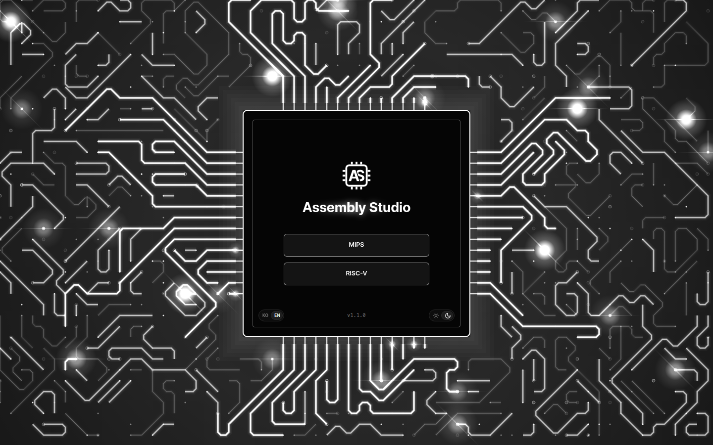
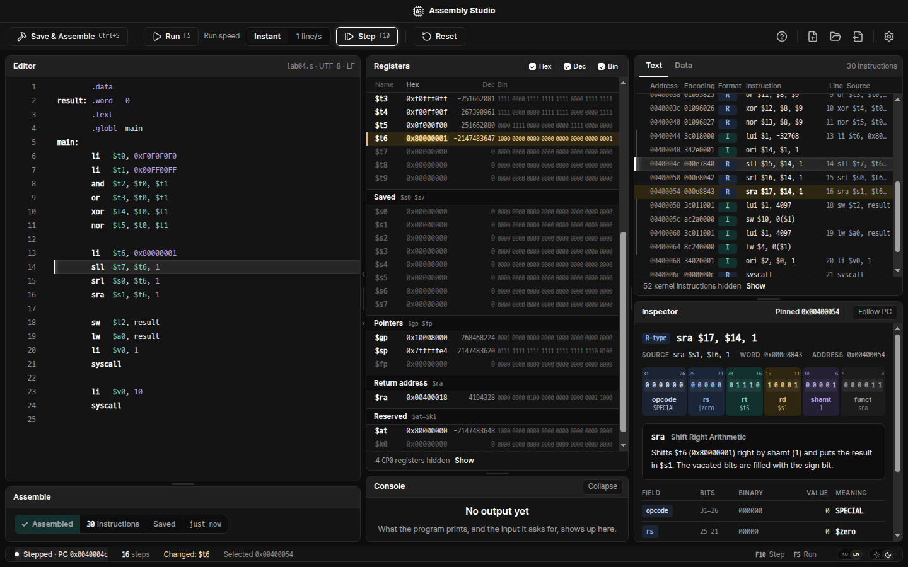
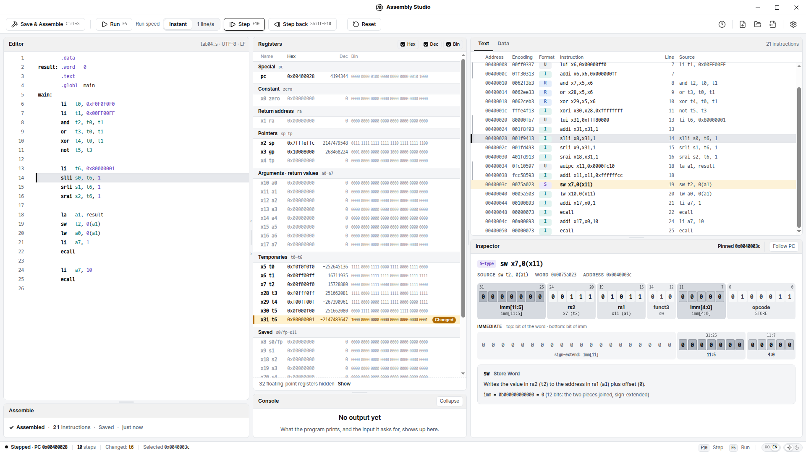
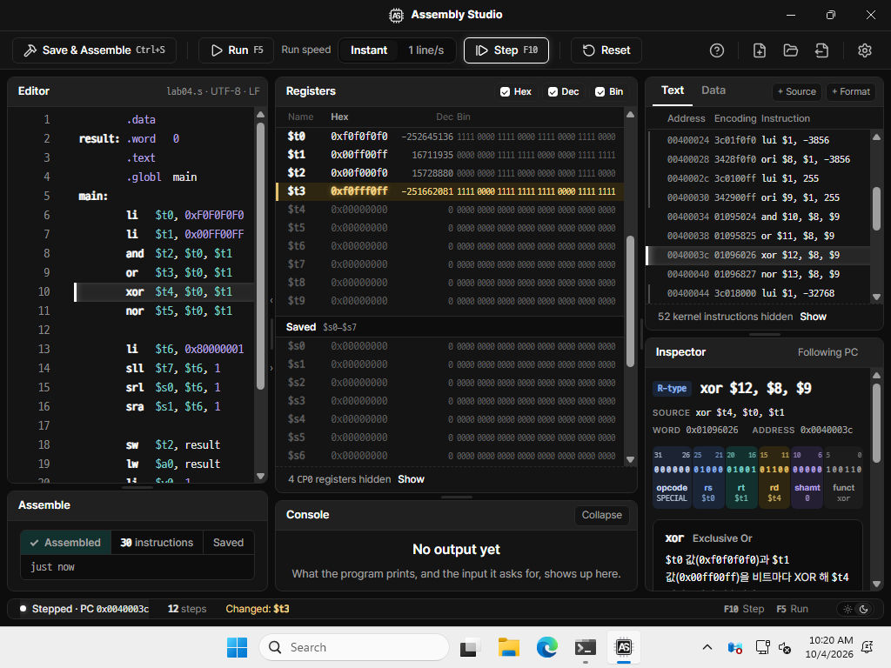
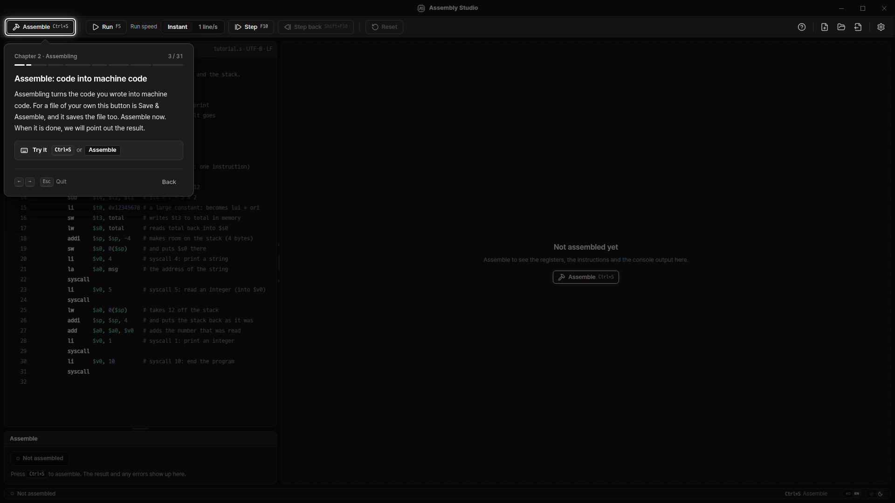
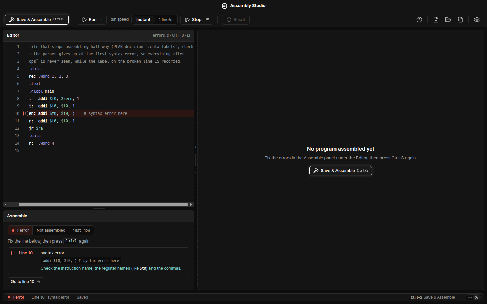

# Assembly Studio

Assembly Studio is a Windows desktop simulator for MIPS and RISC-V assembly. You write a program, assemble it,
and run it one line at a time while you watch the registers, the memory and the 32 bits of each instruction
change. On launch you choose the ISA: MIPS runs on the SPIM 9.1.24 engine, RISC-V on the RARS 1.6 engine. The
installer includes the Java runtime that RARS needs, so there is nothing else to install.

*The first screen: choose the ISA, then start.*

*Working on a MIPS program: editor, Registers, Text/Data, Inspector and Console.*

*A RISC-V program in the light theme.*

## Contents

- [Download and install](#download-and-install)
- [First run](#first-run)
- [Using Assembly Studio](#using-assembly-studio)
- [Executable image export (.asx)](#executable-image-export-asx)
- [Building from source](#building-from-source)
- [Project layout](#project-layout)
- [Releases and versioning](#releases-and-versioning)
- [License and third-party notices](#license-and-third-party-notices)
- [Author](#author)

## Download and install

Requirements: Windows 10 or 11, 64-bit (x64).

1. Download `AssemblyStudio-<version>-win-x64-setup.exe` from [Releases](../../releases).
2. Run it. It installs for the current user only, without administrator rights, into
   `%LOCALAPPDATA%\Programs\Assembly Studio`, and adds a Start menu shortcut. The installer is in English.
3. The program includes its own Java runtime (Eclipse Temurin 21) for the RISC-V engine. You do not need to
   install Java.

To uninstall, use Windows Settings › Apps.

*Assembly Studio on Windows.*

## First run

1. On the first screen, choose **MIPS** or **RISC-V**. You choose on every launch; the choice is not remembered.
2. Choose **Start now** (바로 시작) or **Take the tutorial** (튜토리얼 보기).
   - **Start now** then offers **New file** (새 파일) and **Open file** (파일 열기).
   - **The tutorial** walks you through the screen and the basic controls with an example program, step by step
     (7 chapters, 26 steps, for both ISAs), in Korean or English (see **Language** below). On the work screen you can start it
     again at any time with the question-mark button at the right of the toolbar.
3. To change the ISA later, click the logo in the title bar. It returns to the first screen.

*A tutorial card.*

## Using Assembly Studio

### Keys and actions

| To do this | Do this |
|---|---|
| Save and assemble | **Save & Assemble**, or `Ctrl+S`. Results and errors appear in the Assemble panel below the Editor |
| Run one line | **Step**, or `F10` |
| Run to the end or to a breakpoint | **Run**, or `F5`. While it runs, the button becomes **Stop**; `Esc` also stops it |
| Run slowly | Set **Run speed** to **1 line/s**, then Run (**Instant** is full speed) |
| Go back to the start | **Reset**. It restarts the last assembled program; it does not assemble again |
| Set or clear a breakpoint | Click the gutter to the left of the line numbers in the Editor |
| Comment or uncomment lines | `Ctrl+/` |
| Change the font size | `Ctrl` `+`, `Ctrl` `-`, `Ctrl` `0` (reset), or Settings |
| Open a file | `Ctrl+O`, or the Open file button in the toolbar |
| Start a new file | The New file button in the toolbar |
| Export an executable image | The Export executable image (.asx) button in the toolbar ([format](docs/asx-format.md)) |
| Show the tutorial again | The question-mark button in the toolbar |
| Choose the other ISA | Click the logo in the title bar |

### Panels

- **Editor.** A code editor with syntax highlighting. A dot next to the file name in the Editor's header means there
  are unsaved changes.
- **Assemble.** Below the Editor. It shows whether the program assembled and lists errors and warnings with their
  line and a hint on how to fix them. **Go to line** moves the cursor to the line with the error.

  
  *An assembly error in the Assemble panel, with Go to line.*

- **Registers.** **Hex**, **Dec** and **Bin** in the panel header turn each column on or off. The registers that the
  last instruction changed are highlighted.
  - **Pinning:** click the star on a row to pin that register to the **Pinned** group at the top.
  - **Aliases:** double-click the name of a pinned register to give it an alias.
- **Text and Data.** The **Text** tab lists the assembled instructions: address, machine code, format and the source
  line. The **Data** tab shows the data and the stack in memory. **Hex**, **Dec** and **Bin** in the Data tab's header
  choose the radix of the values.
- **Inspector.** Splits one instruction into its 32-bit fields and shows each field's name, value and meaning (the
  explanation is in the language you chose). Click an instruction in the Text tab to keep the Inspector on it; **Follow PC** (or
  `Esc`) makes it follow the current instruction again.
- **Console.** The program's output, and the box for its input.
- **Light and dark.** The sun/moon switch at the bottom right (on the first screen, the card's bottom-right corner).
- **Language.** The KO/EN switch beside it (on the first screen, the card's bottom-left corner), or Settings ›
  **Language**: Korean or English for the first screen, the tutorial, the instruction explanations, the dialogs and
  the tutorial's example comments. The panels, buttons and status line are in English in both. It starts in the
  system's language (Korean on a Korean system, English otherwise).
- **Resizing.** Drag the border between two panels to resize them. Double-click a border to return to the default size.
- **Settings.** The gear button in the toolbar:
  - **Font size**;
  - **Data radix** (the same choice as in the Data tab);
  - **Language** (KO / EN, the same as the switches);
  - **Advanced** (MIPS only): machine options (pseudo-instructions, delayed branches, delayed loads, mapped I/O,
    quiet), program arguments, and the exception handler;
  - **About · Licenses**: the version, the engine, and every license (see [below](#license-and-third-party-notices)).

Settings, the language, the theme and the panel layout last only for the current session. The next launch starts with the defaults, so a
shared PC always starts the same way.

## Executable image export (.asx)

The toolbar button **Export executable image (.asx)** saves the assembled program as an `.asx` file: a text file that
holds the program exactly as it sits in memory (instruction words, data bytes, the start address, register values and
labels). It works in both ISAs and always exports the program assembled last. The format is specified in
[docs/asx-format.md](docs/asx-format.md).

## Building from source

The installer is built for Windows x64. Development also works on Linux.

Requirements:

- Node.js 22.18 or later.
- For the MIPS addon: a C++ toolchain for node-gyp, plus bison and flex (Linux: `bison`, `flex`, `g++`).
- For the RISC-V engine: JDK 21 on `PATH`, and git.

Commands, in `electron/`:

    npm ci && npm run build      # dependencies, the addon (Linux: bison, flex, g++)
    npm run brand                # put the brand in place (generates src/brand.ts, src/renderer/assets/brand/)
    npm run typecheck
    npm test                     # core unit tests
    npm run electron [-- --isa=riscv]   # run the app (MIPS by default)
    xvfb-run -a -s '-screen 0 2400x1400x24' npm run shot -- <out-dir> [width] [--isa riscv]   # screenshots

The RISC-V engine, from the repository root:

    bash probe/setup.sh          # downloads RARS into ~/.cache/assembly-studio/rars and builds it
    bash probe/run.sh build      # builds RarsProbe into probe/build/classes

If `electron/engine/{runtime,rars.jar,classes}` exists, the app uses it first. `node engines/fetch.mjs` downloads the
prebuilt Windows engines there (see [engines/README.md](engines/README.md)).

Packaging, in `electron/`:

    npm run build:electron       # the addon, built against Electron's headers
    npm run package              # the NSIS installer (on Windows), in electron/dist/
    npm run package:dir          # an unpacked build for this platform (a quick check)

More detail: [CLAUDE.md](CLAUDE.md) (working rules and commands), [PLAN.md](PLAN.md) (design decisions),
[docs/engine-protocol.md](docs/engine-protocol.md) (the RISC-V engine protocol).

## Project layout

| Path | What |
|---|---|
| `CPU/` | The SPIM simulator core, used unmodified |
| `probe/` | `RarsProbe`, the Java wrapper around RARS (RARS itself is built from a pinned commit, unmodified) |
| `electron/src/` | The app: main process, renderer, MIPS core and simulator, and `isa/riscv/` for RISC-V |
| `electron/native/` | The SPIM N-API addon |
| `electron/brands/generic/` | Name, app ID, mark, icons and installer pictures |
| `engines/` | Engine build pins and scripts |
| `.github/workflows/` | `engines.yml` (engine build) and `release.yml` (installer and release) |
| `docs/` | The `.asx` format, the engine protocol and release notes |

## Releases and versioning

Releases are published on the [Releases](../../releases) page, one installer per version, with notes from
`docs/releases/<version>.md` (for example [1.0.0](docs/releases/1.0.0.md)).

After 1.0.0, every change ships under a new version:

- **1.x.y**: fixes (the last number).
- **1.x.0**: new features.

Each version is developed on its own branch, `release/<version>`; the branch of the latest version is the default
branch.

Earlier releases are not deleted. If a release has a problem, you can install the previous one until a fix is out.

## License and third-party notices

Assembly Studio is released under the **BSD 3-Clause License**, Copyright (c) 2026, Hakhyeon Kim (AIAC Lab).
See [LICENSE](LICENSE).

The program includes the third-party components below. Each keeps its own license. [NOTICE](NOTICE) lists every
component with its version, copyright holders, use and the location of its full license text. In the installed
program, open **Settings › About · Licenses › Licenses**. The license files also sit in the install folder
(`LICENSE.txt`, `NOTICE.txt`, `LICENSE.electron.txt`, `LICENSES.chromium.html`, and the Java runtime's
`resources\engine\runtime\legal\`).

| Component | Version | License | Used for |
|---|---|---|---|
| Assembly Studio | 1.0.0 | BSD-3-Clause | This program |
| SPIM | 9.1.24 | BSD-3-Clause (SPIM license) | MIPS engine |
| RARS | 1.6 | MIT | RISC-V engine |
| jEdit syntax package (inside RARS) | — | Permissive notice (see NOTICE) | Part of the unmodified RARS jar |
| JSoftFloat (inside RARS) | — | MIT | Floating point in RARS |
| Eclipse Temurin (OpenJDK) | 21.0.12.1+1 | GPL-2.0 with Classpath Exception | Java runtime for RARS |
| Electron | 44.4.5 | MIT | Application shell |
| Chromium (inside Electron) | 152.0.7977.130 | BSD-3-Clause and others | Rendering |
| Node.js (inside Electron) | 24.21.0 | MIT and others | Main and simulator processes |
| Pretendard | 1.3.9 | SIL OFL 1.1 | Interface font |
| D2Coding | 1.3.3 | SIL OFL 1.1 | Code font |
| Lucide | — | ISC (Feather-derived icons: MIT) | Icons |
| CodeMirror, @lezer, and their dependencies | see NOTICE | MIT | Code editor |
| iconv-lite, safer-buffer | 0.7.3, 2.1.2 | MIT | Reading and writing CP949 files |
| node-addon-api | 8.9.2 | MIT | C++ binding of the SPIM addon |
| flex | 2.6 | BSD-style (acknowledgement) | Generated SPIM's scanner |
| GNU Bison | — | GPL-3.0-or-later with Bison exception | Generated SPIM's parser |
| NSIS, electron-builder | — | Zlib, MIT | Installer and uninstaller |

MIPS is a trademark of MIPS. RISC-V is a trademark of RISC-V International. This software is not affiliated with, nor
endorsed by, either.

## Author

Made by Hakhyeon Kim · AIAC Lab
